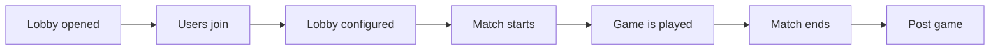

# Match lifecycle
The main purpose of Teiserver is to facilitate running a game; as a result the Lobby and Match systems are one of the core features and have a lot of customisation and flexibility.

In every case where the `Game` context is used there is a similar or identical function in `Api`.

### Overview
There are multiple stages to a match taking place, they will typically follow the below diagram.

## Open lobby
A call to either `Teiserver.Game.open_lobby/2` is used to open the lobby. You must pass in the user_id of the host (who must also be connected) and the initial name for the lobby.

This will create a `Teiserver.Game.LobbyServer` process to store the state of the lobby. When the lobby is opened a minimal `Teiserver.Game.Match` object is created and the lobby process updated to point to it.

## Users joining
After creating a lobby; users will be able to join. The nature of which will depend on your config [`lobby_join_method`](config.html#lobby_join_method-default-simple).

### Joining
To add a client to the lobby you will need to call `Teiserver.Game.add_client_to_lobby/2`. Assuming this is successful the following will take place:
- The lobby state will be updated to add this user to the member list and the spectator list
- The lobby process will subscribe to updates about the client
- The client process will be updated with default lobby details

### Leaving
To remove a client from a lobby you will need to call `Teiserver.Game.remove_client_from_lobby/2`. When this is called the following takes place:
- The client process is updated to show they are no longer in the lobby
- The lobby state will be updated to remove this user from the member, spectator and player lists as appropriate

### Client updates
Typically a client will update via `Teiserver.Connections.update_client/2` but if you want to update the lobby details of a client you should use `Teiserver.Connections.update_client_in_lobby/2`.

The standard `update_client` only contacts the ClientServer to update values but with the `update_client_in_lobby` function the ClientServer will check with the LobbyServer before updating any details to ensure it is allowed to.

## Lobby configuration
> #### Not fully implemented {: .error}
>
> Options for configuration through votes will be added and will result in additional details in this section.

Lobbies have a key `:game_settings` which holds key-value map of the settings chosen for the upcoming match. These can be changed at any time prior to the match starting.

## Match start
When the match is started and the users move into playing the game itself (which does not take place on the middleware server) a call needs to be made to `Api` or `Game` `start_match/1` (delegated to `Teiserver.Game.MatchLib.start_match/1`).

This will update the previously added Match object with the relevant information from the Lobby. It will create `Teiserver.Game.MatchMembership` objects for each player, create the relevant `Teiserver.Game.MatchSetting` objects (along with types) and update the Lobby to show the match as ongoing.

## Playing the game
While the game is ongoing the server is not directly involved except for anything the host wishes to relay to the server such as public chat or game telemetry events.

## Match end
At the conclusion of the match players should be returned to the lobby interface and the `Api` or `Game` `end_match/2` (delegated to `Teiserver.Game.MatchLib.end_match/2`) should be called.

This will update both the Match object and MatchMembership objects with the relevant data.

## Post game
### Close
In some cases you will want the lobby to close in which case `Api` or `Game` `close_lobby/1` (delegated to `Teiserver.Game.LobbyLib.close_lobby/1`) should be called. This will remove everybody from the lobby and stop the lobby process.

### Cycle
If you wish to keep the lobby in existence you should call `Api` or `Game` `cycle_lobby/1` (delegated to `Teiserver.Game.LobbyLib.cycle_lobby/1`) which will create a new empty Match object for the new upcoming match.
