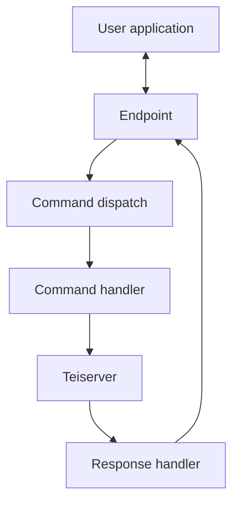

# Library interaction

## User to Teiserver
The expectation is your users will have an application running on their machine, this application will connect to your endpoint (websocket, grpc, plaintext etc). Your endpoint will be an Elixir application running Teiserver as a dependency and making the calls to it.

