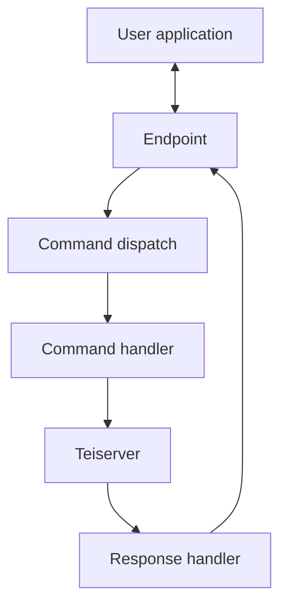
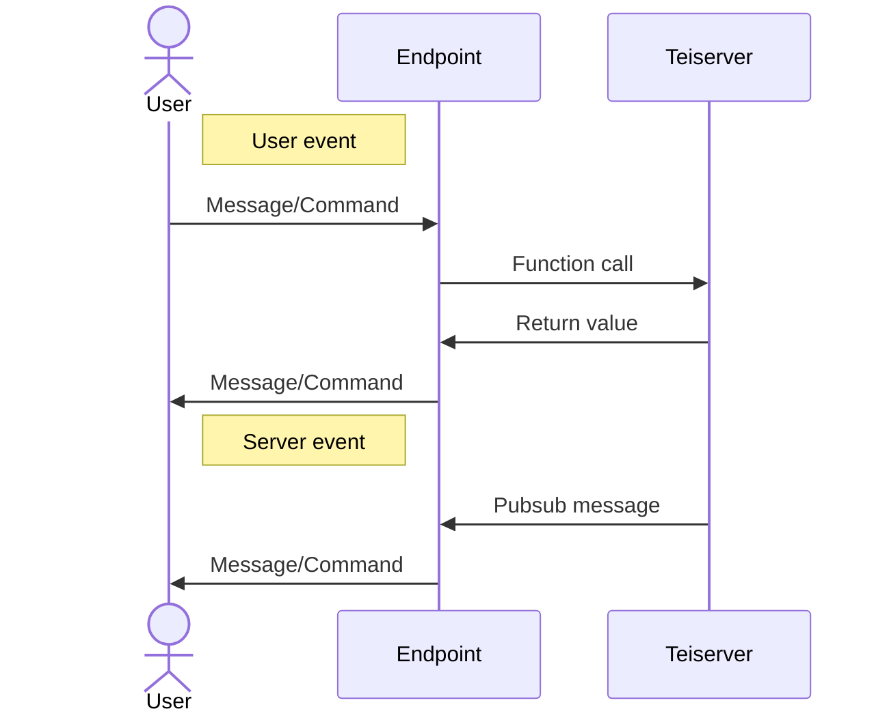

# Program structure

## User to Teiserver
The expectation is your users will have an application running on their machine, this application will connect to your endpoint (websocket, grpc, plaintext etc). Your endpoint will be an Elixir application running Teiserver as a dependency and making the calls to it.

## Endpoint information flow
The endpoints are can communicate with users however you want. In terms of Teiserver they are expected to make function calls to Teiserver context modules and receive information via return values and also process messages (typically via Pubsubs).

